# CAPSTON ANÁLISIS E INSIGHTS

## 1. Introducción

### 1.1 Definición del problema
El objetivo inicial de este análisis fue determinar las rutas entre estaciones para que la reposición de las bicis fuera más rápida y efectiva.
Responder a esta pregunta requiere más tiempo del disponible para este proyecto, por lo que hemos dividido esa pregunta en pequeños análisis que ayudarán a, si alguien quiere seguir con esta propuesta, responder a esa gran pregunta. 

1. Identificar los patrones que existen durante un día entero en una estación del Bicing.
2. Identificar los patrones que existen en una estación durante un mes cogiendo siempre el mismo día (ex:jueves)
3. Extrapolarlo a tres estaciones con alturas diferentes. Una parte alta de Barcelona, otra por la parte del Eixample y otra por la zona costera.

### 1.2 Áreas de Enfoque
El análisis se ha centrado en las siguientes variables clave: station_id, name, lat, lon, altitude, post_code, capacity, last_reported, num_bikes_available, num_docks_available,
 minute, hour, day, month, year.
Como datos externos se han considerado si es fin de semana o no (is_weekend) y si es un día de fiesta o no

### 1.3 Alcance Temporal
El análisis cubre datos recolectados de enero, febrero y marzo de 2023 con una frecuencia por minutos.

### 1.4 Limitaciones
Se ha asumido que las tendencias observadas en los datos estudiados son representativas de los comportamientos futuros.

### 1.5 Exclusiones
Al extraer la información y empezar a analizarla, nos dimos cuenta de que las estaciones [ 48, 188, 429, 487, 520] no tenían información de ningún tipo. 
Para nuestro estudio no eran relevantes, por lo que decimos excluirlas del análisis. 

## 2. Metodología

### 2.1 Fuentes de datos
#### 2.1.1 Descripción de las Fuentes de Datos

- **Internas**: Se utilizaron datos del sistema del Bicing de Barcelona.
- **Externas**: También se incluyeron datos de los barrios de Barcelona, calendario de fiestas y de fines de semana. 

#### 2.1.2 Tipos de Datos

- Datos de geolocalización: latitud, longitud, código postal, altura.
- Datos temporales: fecha, año, mes, día, minutos, horas.
- Datos cuantitativos: capacidad de las estaciones, bicis disponibles
- Datos nominales: nombre de las estaciones y su id.

### 2.2 Herramientas y Técnicas
Para llevar a cabo este análisis hemos utilizado el editor Google Colaboratory para programar en Python.
En concreto nos hemos apoyado en estas librerias:
- Pandas 
- Geopandas 
- Numpy
- Os
- Datetime
- Matplotlib lines
- Plotly graph objects
- Matplotlib pyplot
- Seaborn

#### 2.2.1 Técnicas y pasos realizados

Antes de empezar con todo el análisis hemos hecho un pequeño pre procesado a los datos para prepararlos. Durante este
proceso nos dimos cuenta de que había unas estaciones que carecían de información, por lo que decidimos excluirlas del dataset.
Dado que no íbamos a estudiar esas en concreto, no afecta a la visión general ni concreta del análisis. 
Las estaciones excluidas son las nombradas en el apartado **1.5**,[ 48, 188, 429, 487, 520].

##### <u>Análisis de la ocupación y capacidad usual de las estaciones y su comportamiento</u>

Primero, nos hemos preguntado cuál era la ocupación media de las estaciones. Queríamos comprobar qué era lo normal 
(grosso modo) para cada estación, si estar más vacía, más llena o un término fluctuando y si tenía algo que ver con su
localización y altura. 
Este aspecto lo quisimos relacionar también con la capacidad de cada estación. 
Para comprobar esto, hemos visualizado en el mapa de Barcelona todas las estaciones.
Las hemos representado según su estado usual, utilizando un círculo rojo/salmón en el caso de que suelan estar más llenas, 
gris para las que suelen fluctuar y azul para las vacías. Ha quedado así: 

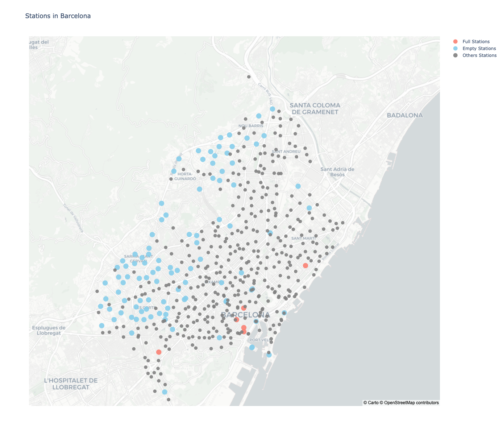

Podemos comprobar a simple vista que usualmente las estaciones con una mayor altura son las que están más vacías, 
por otro lado, donde suele haber llenas es cerca de la costa, que coincide que tienen una altura menor,
por lo que ambos casos se ven, efectivamente, afectados por su localización y altura.

Otro aspecto interesante que hemos detectado es que la capacidad de las estaciones no parece tener ninguna relación con 
la localización de esta. En un primer momento, creímos que esto podría tener relación debido a que las más cercanas al 
mar siempre suelen estar más llenas y, por lo tanto, si tuvieran más capacidad podrían acoger más bicis y el usuario 
dispondría de mayor facilidad para coger o dejar su bici.

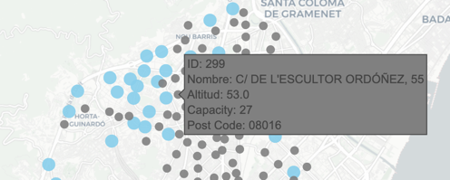 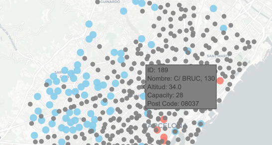 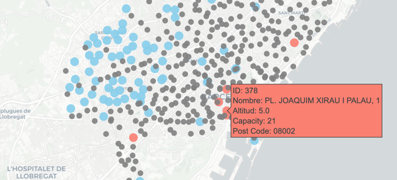

Hemos detectado algunas estaciones que podrían ser outliers. Son casos en los que parece haber dos estaciones en el mismo
punto exacto, pero en un caso es una de esas estaciones que fluctúan y en el otro está vacía. 
Sería un punto donde seguir investigando para saber si realmente existen esas estaciones y cuál es el comportamiento real. 
De este modo, se podrían tomar medidas de unión de estaciones o incluso de eliminación.

A continuación, ponemos un ejemplo en la Ronda Litoral.

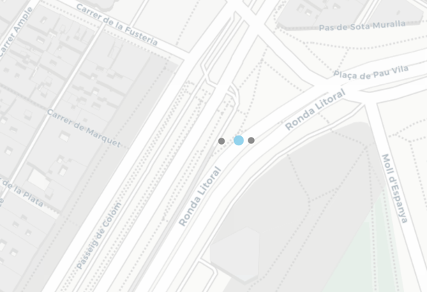

##### <u>Análisis de los patrones durante un día de una sola estación</u>

Segundo, ayudándonos con el mapa, escogimos una estación, la número 371, para empezar a ver los patrones que sigue durante el día.
Escogimos esta porque está en medio de la ciudad y sospechábamos que veríamos mucho movimiento o al menos varios picos 
interesantes. Además, es una de las que, con el análisis anterior, su estado usual era other, es decir, que es de las que 
fluctúan durante el día. Esta estación está en el Carrer dels Enamorats y el análisis es del día 09-03-2023.

Para conseguir visualizar el patrón, hemos creado una clase "Visualization" para agrupar todos los tipos de visualizaciones que 
hemos hecho. Hay variables que son comunes y se registran dentro del _self._ Estas son la fecha, las estaciones, los 
barrios, y los tres estados de las estaciones, llena (full_stations), vacías (empty_stations) y el resto (other_stations).

Para este caso en concreto hemos hecho una función llamada _def plot_occupancy_stats(self)_ para visualizar cómo varía la
capacidad durante el período que se le indique. Los variables _self_ que se le pasan a la función son las siguientes:

- data: el Dataframe
- stations: nombre de las estaciones
- barris: los barrios de Barcelona
- month_year: número del mes según el año
- station_ids: los identificadores de cada estación que se quiere evaluar
- occu_type: tipo de estación según su ocupación
- day_week: número del día según la semana

La frecuencia temporal que hemos establecido es por minutos. Dado que queremos ver los patrones durante todo el día, consideramos 
importante hacer el análisis minuto a minuto para no perdernos ningún detalle. Al principio, habíamos considerado hacerlo por horas 
para reutilizar el dataset generado para el modelo que estaba agrupado por horas, pero nos dimos cuenta de que, si de verdad
queríamos ver los patrones completos, era necesario hacerlo por minutos. Además, tal y como se explica en el documento MODELOS.md 
no se usan todas las variables, dado que no todas aportan valor al modelo. Sin embargo, para esta parte sí que se necesitaban ese tipo de variables,
como la Latitud o Longitud. 

Visualizamos el siguiente gráfico:

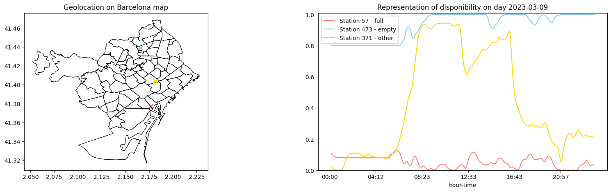

En el gráfico se pueden ver otras dos estaciones, pero queremos focalizar este apartado en la 371, la línea amarilla.

Para entender bien la gráfica hay que tener en cuenta que 0 corresponde a una estación con capacidad nula, es decir, 
que está llena. Y 1 que está completamente vacía, es decir, capacidad al 100%. 

Si nos fijamos en la curva amarilla que representa a la estación 371, observamos lo siguiente:

- **Madrugada (00:00 - 06:00):** Durante las primeras horas de la madrugada, la capacidad de la estación se mantiene muy baja, cercana a 0, lo que indica que la estación está casi llena.

- **Mañana (06:00 - 12:00):**
  - 06:00 - 08:00: Se observa un aumento en la capacidad, alcanzando valores alrededor de 0.4. Esto sugiere que durante estas horas las bicicletas empiezan a ser retiradas para el uso matutino.
  - 08:00 - 10:00: La capacidad sigue aumentando alcanzando 0.9. Indica una alta demanda de bicicletas.
  - 10:00 - 12:00: La capacidad se mantiene alrededor de 0.9 hasta el mediodía, indicando que la estación está casi 
  vacía debido al alto uso de bicicletas.

- **Mediodía (12:00 - 15:30):**
  - 12:00 - 12:30: La capacidad de la estación en cuestión de minutos baja hasta 0.6 aproximadamente. Esto lo hemos hipotetizado
  como que han repuesto las bicicletas, dado que es un aumento de las bicicletas bastante abrupto. Nos respaldamos en
  la franja horaria próxima la gente se dispondría a utilizar las bicis para ir a comer, y como estaba prácticamente vacía
  hacía falta reponer la estación. 
  - 12:30 - 15:30: La capacidad aumenta, lo que quiere decir que están cogiendo las bicicletas. Coincide con la franja de la comida.
   Lo que apoya nuestra teoría.

- **Tarde (15:30 - 19:00):**:
  - 15:30 - 17:00: La capacidad comienza a disminuir abruptamente, llegando a aproximadamente 0.25. Esto indica que las
  bicicletas empiezan a volver. Este pico no nos pareció tan evidente. Podría ser o que la gente vuelve a su trabajo y 
  deja las bicis en la estación o, de nuevo, una reposición dado que solo hay signos de que se vuelva a vaciar al rededor
  de las 21 y no es una hora considerada normal para volver de trabajar.
  - 17:00 - 19:00: La capacidad se mantiene, la gente está trabajando.

- **Noche (19:00 - 24:00):** Durante la tarde y la noche, la capacidad fluctúa, pero tiende a mantenerse en valores bajos,
entre 0.2 y 0.4, lo que indica una ocupación moderada. Hay solo un pico en el que la estación se queda prácticamente llena.
Este pico podría deberse a la gente que vuelve a su casa.

##### <u>Análisis de los patrones durante un mes de una sola estación</u>

Detectar los patrones durante un día aislado no es suficiente para detectar patrones reales de una estación. Como primer
enfoque para empezar a detectar factores está muy bien, pero nosotros queríamos ir más allá. 
¿Pasaría lo mismo el mismo día durante todo el mes?

Para analizarlo, escogimos los jueves del mes de marzo de la misma estación, la 371. 

Estos patrones, los hemos analizado con dos gráficos, un heatmap y dos gráficos de líneas. 
En el primer caso, cada fila es un jueves, cuanto más azul significa más lleno y rojo vacío. En el segundo,
están representados por líneas de colores su media (puntitos). 

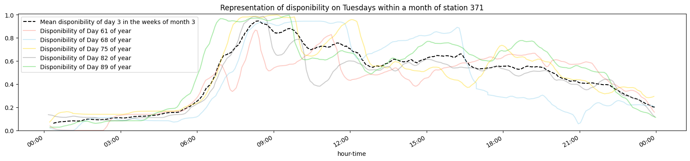
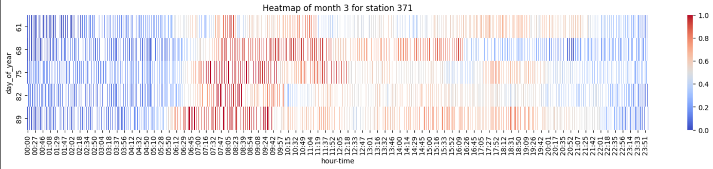

Es superinteresante observar varias tendencias. Primero comentaremos el gráfico de líneas.

- **Madrugada (00:00 - 06:00):** Generalmente, la capacidad es baja durante las primeras horas de la madrugada, con un pequeño incremento justo antes del amanecer en algunos días.

- **Mañana (06:00 - 12:00):** 
  - 06:00 - 08:00: Hay un aumento significativo en la capacidad durante las primeras horas de la mañana, alcanzando un pico a las 08:00, lo cual es típico del inicio de la jornada laboral.
  - 08:00 - 10:00: La capacidad se mantiene. La gente está trabajando. Excepto el día 61 que es el único que difiere del
  resto y tiene un pico de llenado y vaciado de bicis en esta franja. Es como si la gente hubiera empezado a trabajar más
  tarde ese día y todos los movimientos de esta franja se desplazaran 1 hora a la derecha.
  - 10:00 - 12:00: todos siguen prácticamente la misma tendencia aunque un poco desplazadas. Esto lo hemos atribuído a
  la hora del almuerzo y la variabilidad en las rutinas de las personas. 

- **Mediodía (12:00 - 16:00):** Es súperinteresante observar que realmente todos los jueves se sigue la misma tendencia o rutina.
Coinciden mucho todas las líneas.

- **Tarde y Noche (16:00 - 24:00):** La capacidad disminuye gradualmente después del mediodía y muestra fluctuaciones. 
En el caso del día 68 (9 de marzo) la franja de 17 a 21 sí que cambia respecto a los otros días. Nos consta que el día anterior
fue el día de la mujer y podría haber afectado en algo a la rutina de los usuarios. También parece que podría haber tenido lugar una
reposición de bicicletas a las 17h aproximadamente, dado que la disponibilidad cae bruscamente.
Es la misma tendencia en casi todos los casos. 

Si toda esta información la complementamos con el heatmap, vemos claramente, cómo, gracias a los colores, los patrones
son prácticamente los mismos cada jueves. Con sus pequeñas fluctuaciones debido a las diferentes rutinas de los usuarios. 

En conclusión, parece que si se cumplen los mismos patrones, por lo que quizá nos pueda ayudar a determinar las horas clave 
para hacer reposición de bicis y si se comparara con las estaciones de alrededor, quizá hasta de d´nde sería más óptimo
cogerlas así responderíamos a la pregunta original.

##### <u>Análisis de los patrones durante tres meses de una sola estación</u>

###### Month 1 - Enero 2023

Este mes lo hemos planteado para tener una muestra donde seguramente los patrones no estaban tan claros debido a Reyes y frío
entre otras cosas.

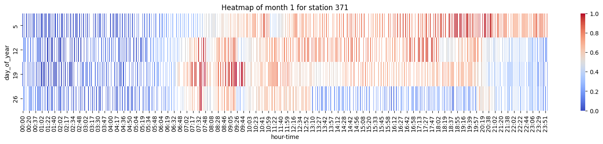
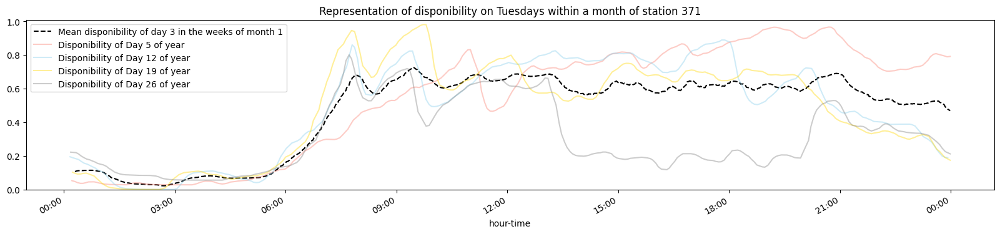

Si nos fijamos en el heatmap, tenemos que el primer jueves de la primera semana, que resulta ser día de cabalgata,
tenemos que durante casi todo el día la estación está prácticamente vacía, sobre todo, por la tarde y noche que es cuando 
empieza la cabalgata y después los padres están en sus casas preparando los regalos.
Los siguientes dos jueves corresponderían a días laborables normales y vemos que presentan el mismo patrón. Comparándolo 
con el gráfico de líneas, la azul y amarilla, vemos que efectivamente los patrones son muy parecidos, contando con ligeras 
fluctuaciones propias de las diferentes rutinas, como hemos visto en el caso de estudio anterior.
La última semana nos sorprendió mucho su comportamiento, dado que durante toda una franja de 13h a 20h
la estación quedó prácticamente llena y sin apenas movimientos. Comparando con la fuente de meteorología de ese día, hemos
comprobado que ese fue un día con temperaturas muy bajas, lo que pudo causar este escenario. Nuestra teoría es que
los usuarios volvieron de comer, llenaron la estación, y después a la vuelta volvieron en otro tipo de transporte debido
al frío. 

Sería muy interesante poder profundizar en este día comparándolo con otros días de mucho frío para ver si el comportamiento
de los usuarios es el mismo o parecido.

###### Month 2 - Febrero 2023

En el mes de febrero hubo solo una fiesta relevante para nuestra muestra. La semana del día 54 se celebró carnaval, en concreto, 
que equivale al 23 de febrero.

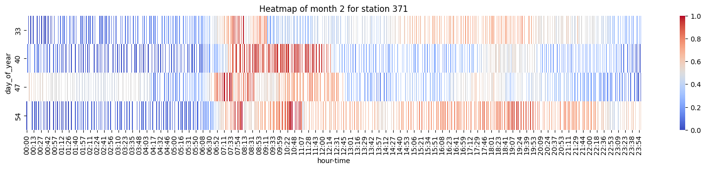

Durante este mes los cambios más bruscos de patrones surgen en la franja de 09h a 13h. Los días más parecidos en esa franja
son el 40 y 47 los patrones coinciden bastante. Sin embargo, el más distinto es el 54, que Barcelona estaba en pleno carnaval.
En este caso la estación permanece durante casi todo el día bastante ocupada.

En la franja de 18h a 24h la tendencia es la misma en todos los casos.

###### Month 3 - Marzo 2023

El mes de Marzo se ha explicado en el apartado anterior.

##### <u>Análisis extrapolado a 3 estaciones de sus patrones durante un día</u>

En el primer análisis hemos estudiado el comportamiento de una sola estación durante el día 09-03-2023. En este caso estudiaremos el comportamiento
de dos más. La 57 que está cerca del mar y la 473 que está por la parte alta de Barcelona.

Como se ve en la leyenda del gráfico la 57 se caracteriza por estar usualmente es un estado de plena ocupación, sin embargo, la 473 suele
estar más bien vacía. 

Es interesante contemplar como, efectivamente, se cumplen para las tres estaciones, estas aproximaciones de la capacidad
usual en un día aleatorio.
Otro aspecto a destacar es que, en un principio nosotros pensamos que por la mañana temprano, la estación 473 estaría 
llena, pero, por el contrario, está en su mayoría vacía. Y lo mismo ocurre con la 57, lo lógico para nosotros era que
durante las primeras horas de la mañana estuviera vacía para que la gente que baja por la mañana pudiera dejar sus bicis.
Este podría ser otro punto a seguir investigando. 

##### <u>Análisis extrapolado a 3 estaciones de sus patrones durante un mes</u>

###### Estación 57 - Estado usual "full"

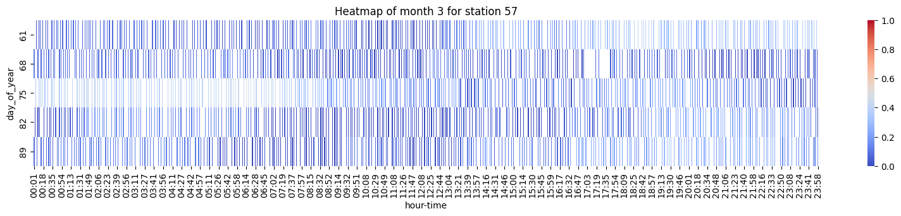

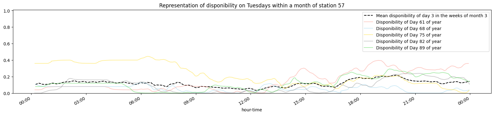

###### Estación 473 - Estado usual "empty"

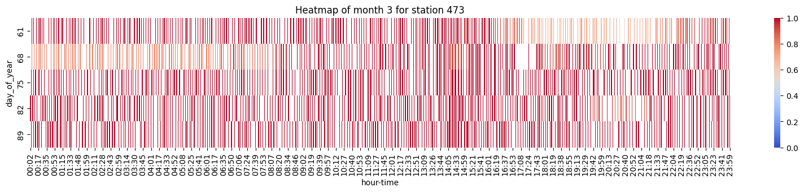

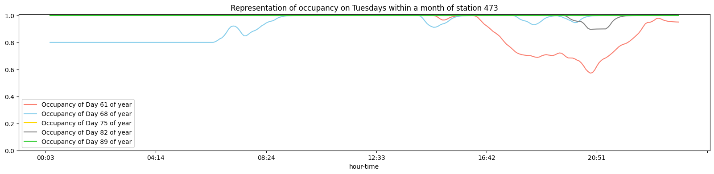

###### Estación 371 - Estado usual "other"

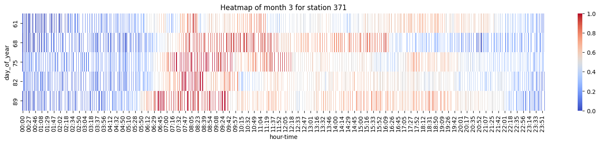

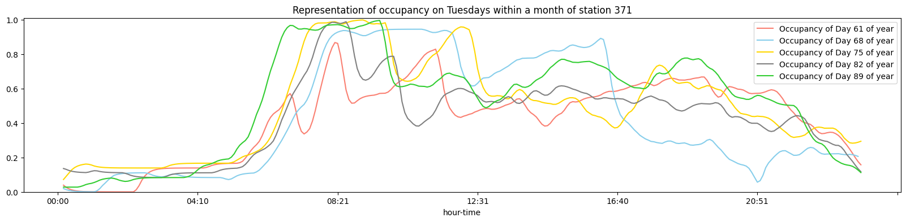

Lo que deducimos de todos estos gráficos es que para cada tipo de estación, los patrones son prácticamente iguales 
siempre y cuando sea un mes sin mucho frío ni con fiestas importantes. 

En el caso de días con mucho frío sí que hemos detectado un posible patrón, pero requiere de más investigación y análisis.

##### <u>Análisis de las 3 estaciones durante una misma semana</u>

Para cambiar un poco el punto de vista de este estudio, hemos querido echar un primer vistazo al comportamiento de las 
estaciones durante toda una misma semana. ¿Se cumplirán patrones entre diferentes días?

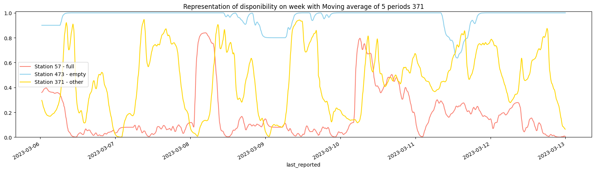

El gráfico muestra la evolución de la disponibilidad de sitios libres en tres estaciones de bicicletas (estación 57,
estación 473 y estación 371) durante una semana, con un promedio móvil de 5 periodos aplicado. 
Aquí hay un análisis de los patrones observados para cada estación y su posible relación:

## Conclusiones

La pregunta inicial que queríamos empezar a resolver era la posibilidad de crear, a través del estudio de los patrones, 
posibles rutas de reabastecimiento entre estaciones que sean más óptimas y eficaces. No hemos llegado a resolverla, pero 
si nos hemos acercado un poco a la respuesta gracias a los diferentes análisis realizados. Y de ellos hemos sacado las siguientes
conclusiones.

1. Sí existen patrones tanto en días concretos como en la semana en sí.
2. Hay factores que afectan mucho a los movimientos de bicis, por ejemplo, el tiempo/temperatura o si es fiesta o no.
3. Aun habiendo usado una muestra pequeña, ha sorprendido observar que las estaciones, si lo normal es que estén llenas,
siempre suelen estar llenas. Y viceversa. Hay movimiento solo en días puntuales de la semana.
4. La localización no impacta en el número máximo de huecos disponibles en las estaciones.
5. La localización sí tiene mucho impacto en el estado usual de disponibilidad de las estaciones.
6. Hace falta más tiempo y análisis para determinar una red de reabastecimiento.

A raíz de este análisis, hemos pensado algunas mejoras que se le podría hacer a la recogida de datos del Bicing:
1. Registrar las actuales entradas y salidas de bicis de las estaciones. En este análisis hemos teorizado acerca de este
posible suceso, pero no se ha podido estar en ningún caso 100% seguros.
2. Actualización de la Base de Datos. Hemos encontrado mucho ruido en el dataset, en concreto, hemos encontrado varias 
estaciones que no contienen información o está desactualizada y al inicio del análisis nos creo bastante ruido.

 

## Próximos pasos en la investigación

Como hemos expuesto en la conclusión 6, hace falta más análisis para llegar a responder nuestra pregunta. Estos son los pasos
o posibles análisis que creemos que se deberían seguir haciendo:

- Estudiar el comportamiento de estaciones próximas, por ejemplo, de un mismo barrio o colindantes. Depende de su comportamiento
no haría falta mover bicis de abajo arriba, depende de la zona se podría hacer entre ellas mismas.
- Estudio de patrones en días especiales: de frío, de calor, festivos...
- Estudio especial a los casos en que las estaciones están o siempre vacías o siempre llenas. ¿Habría que cambiar de localización?
¿Se podrá hacer algo para reavivarlas?
- 